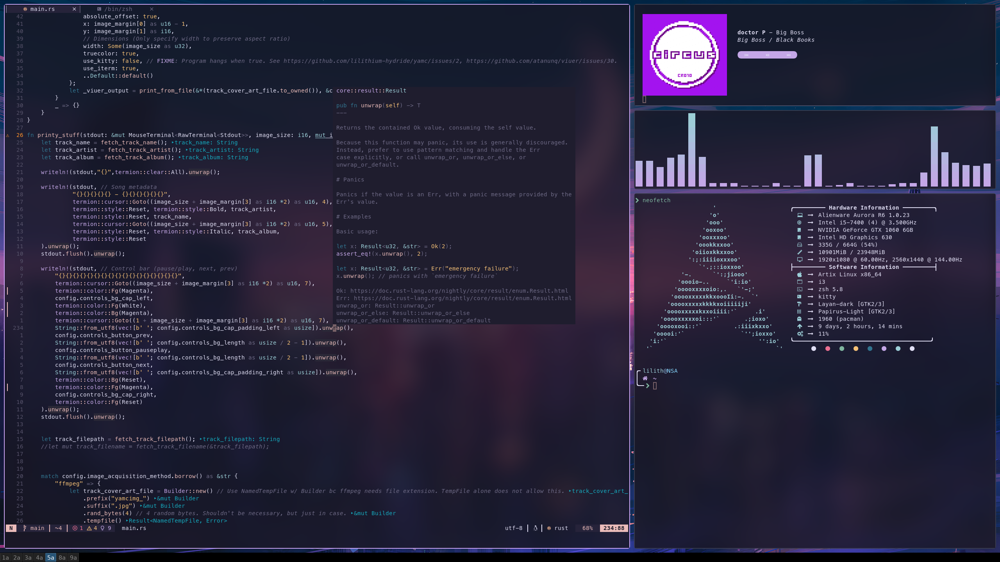

# Lilith's Dotfiles

**Obligatory \*nix user dotfiles repository.**


*Excuses segment: i3's bar hasn't had anything done to it, since Sway is my main WM and I didn't feel like fully ricing i3 if it was gonna get thrown out in a few months. Good ol' Nvidia randomly breaking things. My Neovim config is also heavily under construction while certain plugins and colorschemes are going through some large changes.*


## Installation
Just a fair warning, this is meant for my own personal use and I cannot guarantee any positive or negative effects from running blindly through any installation procedures. Take what you wish from the files, but don't run any commands (or scripts) that you do not understand the full effects of.

### Simple Clone & Unstow
```sh
git clone https://github.com/lilithium-hydride/dotfiles ~/.dotfiles
cd stow
mkdir ~/.secret; touch ~/.secret/.secretsrc; stow -vSt ~ zsh
stow -vSt ~ git
stow -vSt ~ xorg
stow -vSt ~/.config .config
```

### Scary Installer Script
*I cannot recommend running this yourself, but I can't stop you. At least read through the script beforehand to make sure you're happy with it.*
```sh
git clone https://github.com/lilithium-hydride/dotfiles ~/.dotfiles
chmod +x ~/.dotfiles/install.sh
~/.dotfiles/install.sh
```
